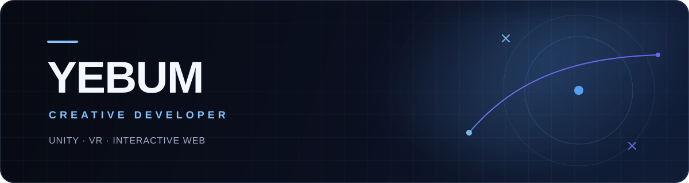

<p align="center">
  
</p>

<h3 align="center">기술과 예술이 만나는 지점을 탐구합니다.</h3>

<p align="center">
  코드를 기능을 구현하는 도구에만 머물지 않고,<br>
  움직임과 감각, 이야기를 만드는 하나의 재료로 바라봅니다.
</p>

## About

Unity, VR, 인터랙티브 웹을 오가며 사람이 직접 보고, 움직이고, 반응할 수 있는 경험을 만듭니다. 아이디어가 화면 안에서 실제 상호작용으로 이어지는 순간에 관심이 많습니다.

새로운 기술을 빠르게 사용하는 것보다, 기술이 왜 필요한지와 그것이 사람에게 어떤 감각으로 남는지를 먼저 고민합니다. 기획과 디자인, 개발의 경계를 자유롭게 넘나들며 낯선 생각을 작동하는 형태로 바꾸는 과정을 좋아합니다.

```text
observe → imagine → build → experience
```

## What I Explore

- **Interactive Systems** — 입력과 상태, 피드백이 유기적으로 이어지는 구조
- **Immersive Experiences** — 공간과 행동을 중심으로 설계하는 VR 인터랙션
- **Creative Technology** — 코드, 움직임, 이미지와 데이터를 결합한 표현
- **Playful Prototypes** — 새로운 아이디어를 직접 만지고 시험할 수 있는 형태

## Selected Work

<table>
  <tr>
    <td width="50%" valign="top">
      <h3>🏴‍☠️ <a href="https://github.com/yebum/PiratesStorm">PiratesStorm</a></h3>
      <p>곡선형 적 경로와 웨이브, 보스 전투를 하나의 항해 흐름으로 연결한 Unity 2D 슈팅 게임입니다.</p>
      <p><code>Unity</code> <code>C#</code> <code>Wave System</code> <code>Object Pooling</code></p>
    </td>
    <td width="50%" valign="top">
      <h3>🍌 <a href="https://github.com/yebum/Invader">Invader</a></h3>
      <p>익숙한 슈팅 규칙에 원숭이와 바나나라는 낯선 이미지를 더한 Unity 3D 아케이드 게임입니다.</p>
      <p><code>Unity</code> <code>C#</code> <code>State Control</code> <code>Collision</code></p>
    </td>
  </tr>
  <tr>
    <td colspan="2" valign="top">
      <h3>🚌 <a href="https://github.com/yebum/JalTayoVR">잘타요VR</a></h3>
      <p>어린이가 버스를 기다리고 타고 내리는 과정을 몸의 행동으로 익히도록 설계한 체험형 VR 안전교육 콘텐츠입니다.</p>
      <p><code>Unity</code> <code>XR Interaction Toolkit</code> <code>VR</code> <code>Experience Design</code></p>
    </td>
  </tr>
</table>

## Tools I Use

<p>
  
  
  
  
  
  
  
  
</p>

---

<p align="center">
  <sub>Somewhere between logic and imagination, an experience begins.</sub>
</p>
